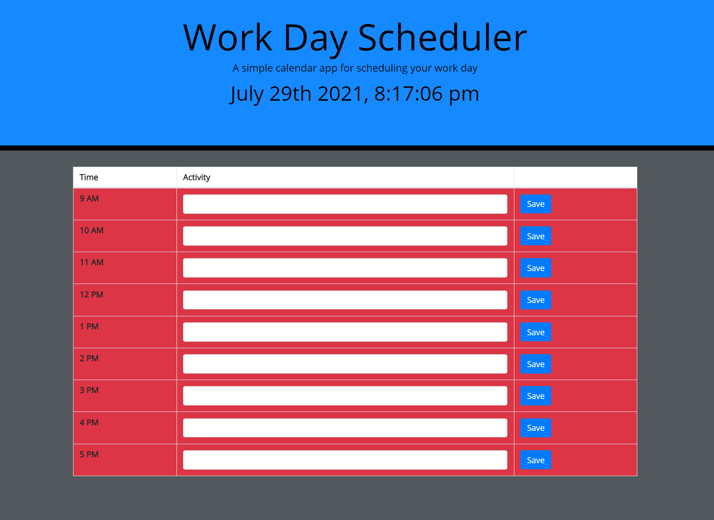

# Coding Quiz

This project was designed for the UC Davis Fullstack Web Development Program. It has been deployed to GitHub pages at the following link:

https://iguessimnick.github.io/homework-05-workday-scheduler

## Summary

* HTML, CSS, and Javascript, Bootstrap, and jQuery was used to create a simple workday scheduler. Momentjs was used to construct the time clock so users know what timwe it is. It blocks out the workday into hours (9-5) and stores user input in the 'activities' field to local storage. It also color coordinates the time blocks; the current hour block is huighlighted in green, past times are highlighted in red, and future times are white. The approach is rough overall, there are most certainly ways to more efficiently render the activities and time blocks, but I could not figure it out. 

## Execution

* Input an activity into whichever hour block that it will take place in
* To save inputs to local storage, click the "Save" button
* To clear hours, delete the input and click "Save" button again

## Author

**Nick Skinner** https://github.com/IGuessImNick

## Acknowledgements

* Thank you to the UC Davis Coding Bootcamp team for making me feel prepared to tackle this assignment.